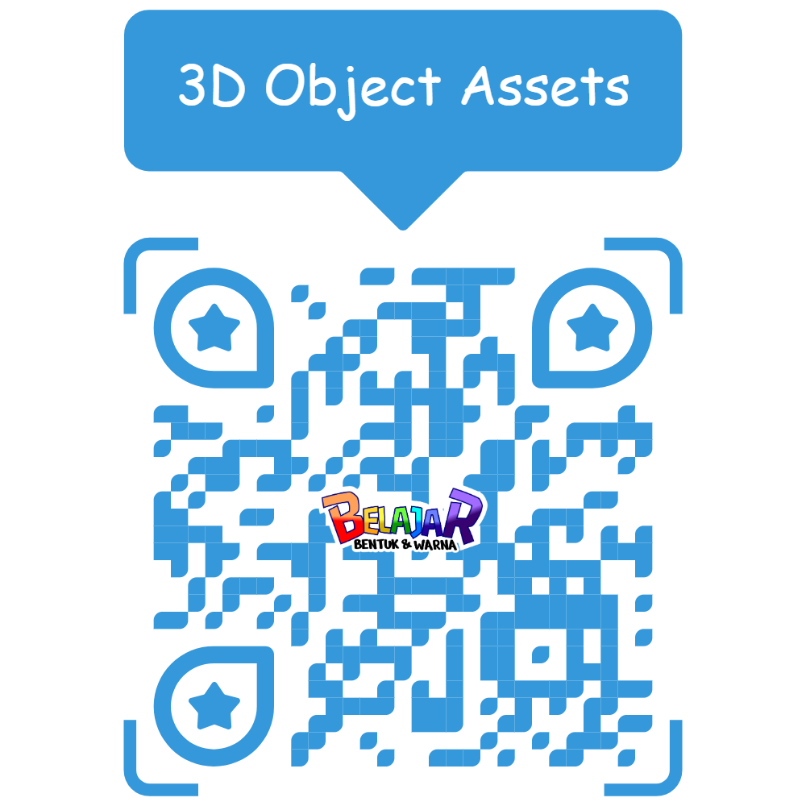
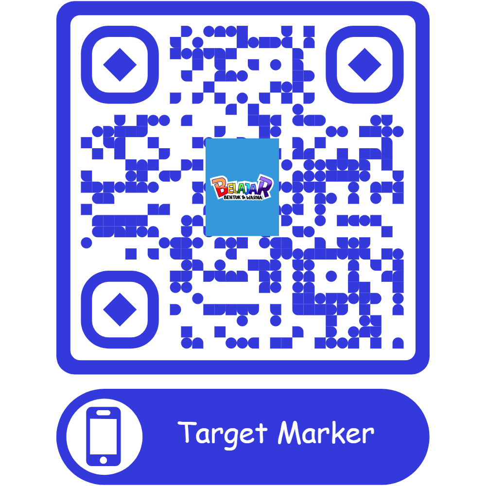

# 📱 AR-Shape-And-Color

**AR-Shape-And-Color** adalah aplikasi pembelajaran interaktif berbasis **Augmented Reality (AR)** yang dirancang untuk **anak usia dini**, fokus pada pengenalan **bentuk dan warna** melalui objek virtual 3D yang muncul saat kamera mengenali kartu marker.

Aplikasi ini dikembangkan menggunakan **Unity** dan bertujuan membantu meningkatkan **motivasi belajar, partisipasi belajar, dan minat belajar anak**. Penelitian ini dilakukan dengan pendekatan **kuantitatif** dan telah diuji melalui observasi langsung terhadap pengguna.

---

## 🎯 Tujuan Aplikasi

- Memberikan pengalaman belajar yang menyenangkan dan imersif bagi anak-anak.
- Membantu guru/orang tua dalam mengenalkan warna dan bentuk secara visual melalui AR.
- Menghadirkan media edukatif yang menarik dan mudah digunakan dalam proses pembelajaran.

---

## ✨ Fitur Utama

- 🔍 **Augmented Reality (AR):** Menampilkan objek 3D (bentuk dan warna) melalui kamera saat kartu marker dikenali.
- 🎨 **Visual Interaktif:** Objek muncul dalam warna cerah dan animasi sederhana untuk menarik perhatian anak.
- 👦 **Desain Ramah Anak:** Tampilan antarmuka sederhana dan intuitif untuk anak usia 4–6 tahun.
- 📈 **Berbasis Penelitian:** Dirancang berdasarkan hasil penelitian skripsi dengan pendekatan kuantitatif, fokus pada efektivitas AR dalam pembelajaran.

---

## 🛠️ Teknologi yang Digunakan

- [Unity 3D](https://unity.com/) (versi yang digunakan dapat disesuaikan)
- [Vuforia Engine](https://developer.vuforia.com/) untuk pengenalan marker
- C# untuk scripting logika AR

---

## 🚀 Cara Instalasi

1. **Clone repository:**
   ```bash
   git clone https://github.com/bilalshansdy04/AR-Shape-And-Color.git


2. **Buka dengan Unity:**

   * Pastikan sudah menginstall Unity Editor (versi sesuai dengan proyek)
   * Buka folder proyek melalui Unity Hub

3. **Build ke Android (jika ingin install di HP):**

   * Aktifkan platform Android di `Build Settings`
   * Export ke `.apk`
   * Instal ke perangkat Android via kabel USB atau share file

4. **Download Marker:**

    * Marker dapat diunduh dengan memindai QR Code yang telah disediakan di bawah, yang mengarahkan ke file marker pada Google Drive.
    
---

## 📚 Tentang Penelitian

Aplikasi ini dikembangkan sebagai bagian dari skripsi dengan pendekatan **kuantitatif**, untuk mengukur **efektivitas AR dalam meningkatkan motivasi, partisipasi, dan minat belajar anak usia dini**.

Metode yang digunakan mengacu pada **Multimedia Development Life Cycle (MDLC)** dan telah melalui tahap pengumpulan data melalui observasi langsung di lapangan.

---

## 📷 Assets

| 3D Object                     | Marker                         |
| ----------------------------- | ------------------------------ |
|  |  |

---

## 📩 Kontak

Jika ingin berdiskusi, kolaborasi, atau mengembangkan lebih lanjut:

- **Nama:** Bilal Shandyarta
- **Email:** \[[bilalshandy04@gmail.com](mailto:bilalshandy04@gmail.com)]
- **GitHub:** [@bilalshandy04](https://github.com/bilalshansdy04)

---

## 📄 Lisensi

Proyek ini bersifat open-source dan dapat dikembangkan lebih lanjut untuk kepentingan pendidikan. Harap tetap mencantumkan sumber jika digunakan kembali dalam bentuk publikasi atau media komersial.

---
